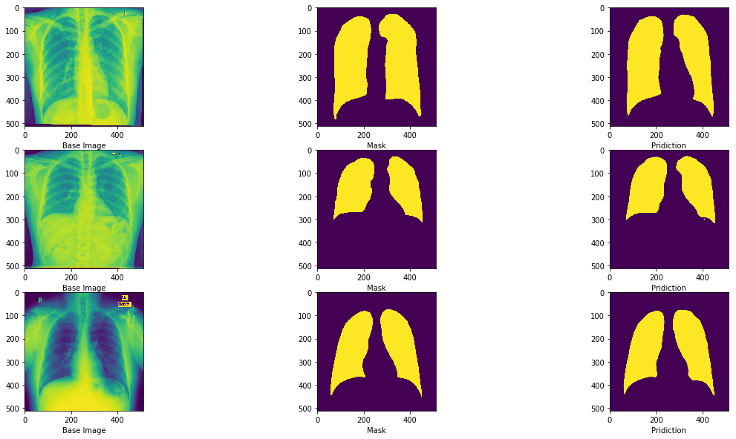
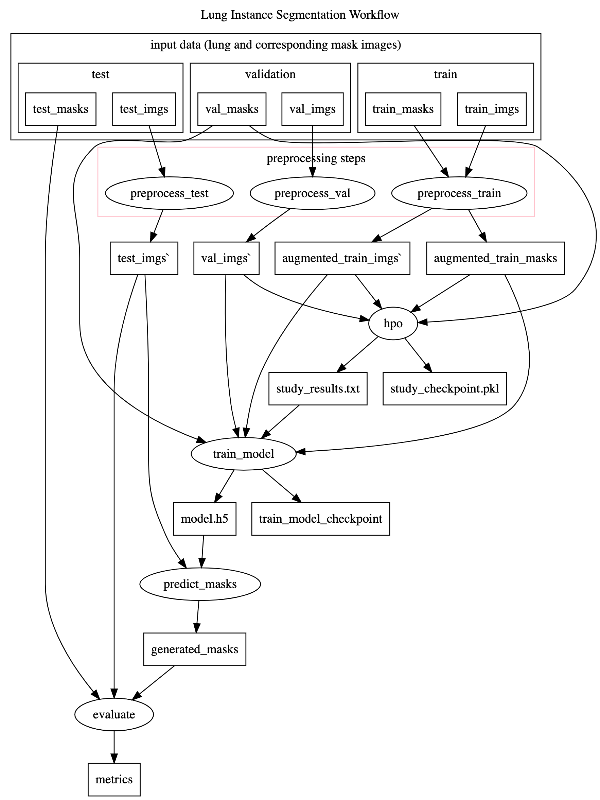
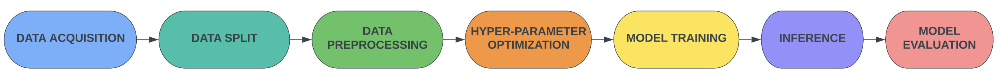
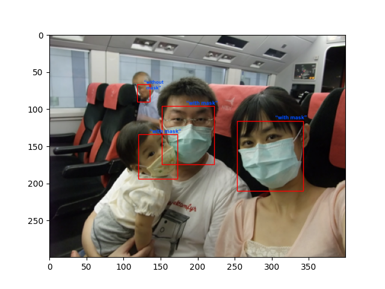
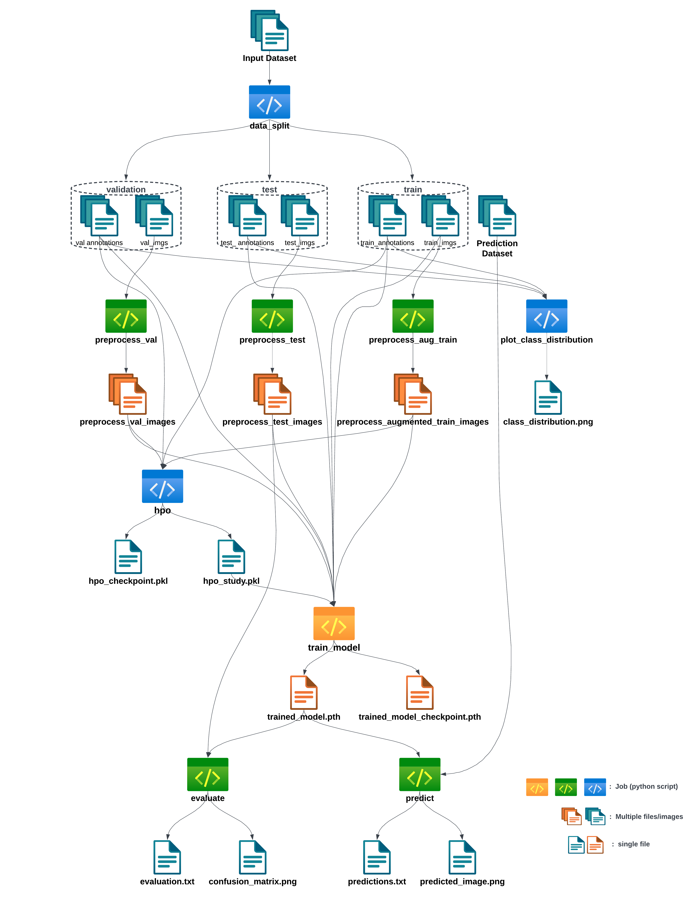
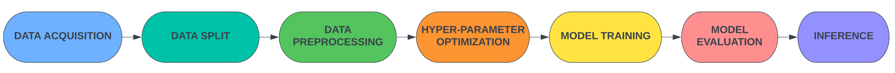
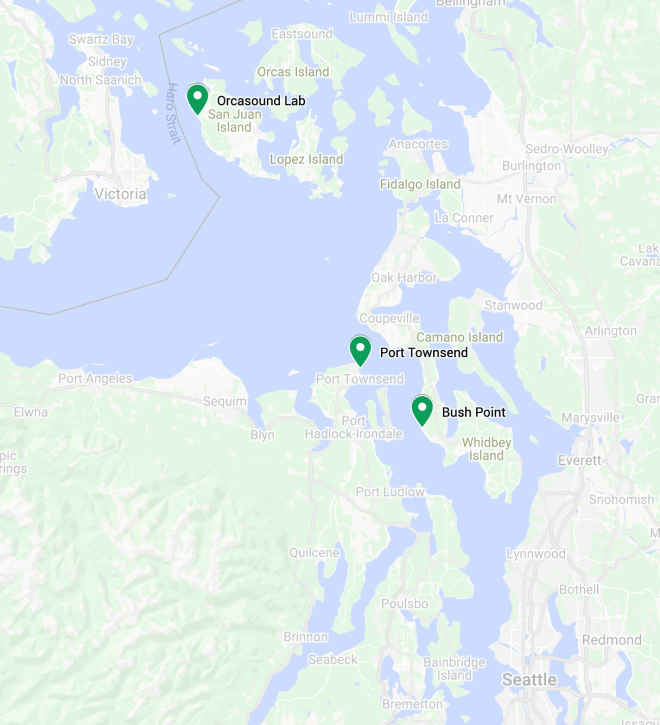
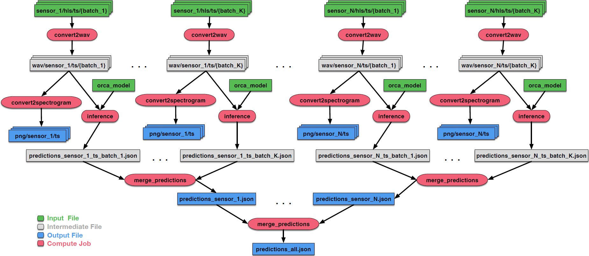
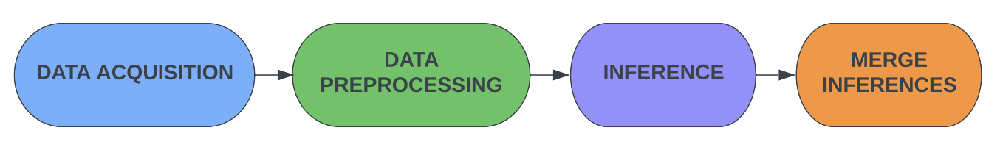

This section consists of Machine Learning workflows, with examples showing various steps in a conventional machine learning pipelines (data-preprocessing, model training, model evaluation, model inference etc). The purpose of these workflows is to exhibit how Pegasus can be utilized in order to parallelize various time consuming components of a machine learning pipeline, mainly data pre-processing or model inferencing. Moreover, machine learning workflows come in handy for experimentation with different input datasets or parameters, thus making it easier to replicate and compare results. The workflows cover different machine learning sub-tasks such as ***Image Segmentation, Classification or Audio Recognition***.

Lung Segmentation
=================
Precise detection of the borders of organs and lesions in medical images such as X-rays, CT, or MRI scans is an essential step towards correct diagnosis and treatment planning. We implement a workflow that employs supervised learning techniques to locate lungs on X-ray images. Lung instance segmentation workflow uses [Chest X-ray](https://www.ncbi.nlm.nih.gov/pmc/articles/PMC4256233/) for predicting lung masks from the images using [U-Net](https://arxiv.org/abs/1505.04597) model.

The workflow uses a ***Chest X-ray Masks*** and Labels dataset (high-resolution X-ray images and masks) availabe publicly. The dataset is split into training, validation, and test sets before the workflow starts. Each set consists of original lung images and their associated masks. The ***Pre-processing*** step and Data Augmentation of Images is done to resize images (lungs and masks) and normalize lung X-rays. Additionally, for each pair of lung image and mask in the train dataset, two new pairs are generated through ***image augmentation*** (e.g., rotations, flips). Next, the train and validation data are passed to the UNet ***hyperparameter optimization*** step, where different learning rates are explored. The ***training*** of UNet fine-tunes the UNet model with the recommended learning rate on the concatenated train and validation set, and obtains the weights. Then ***inference*** on Unet is done using the trained model to generate masks for the test X-ray images. Finally, the ***evaluation*** is performed in order to generate a PDF file with the scores for relevant performance metrics and prints examples of lung segmentation images produced by the model.

  

  

**Machine Learning steps in the workflow :**

  

|       ML step               | Job Label           | Description                                              |
| :--------------------------:| :------------------:|:--------------------------------------------------------:|
| Data Preprocessing          | `preprocess_test`   | data preprocessing for the testing set of x-ray images   |
| Data Preprocessing          | `preprocess_val`    | data preprocessing for the validation set of x-ray images|
| Hyper-Parameter Optimization| `hpo`               | hyperparameter optimization step for UNet model          |
| Model Training              | `train_model`       | training the UNet model and fine-tuning it               |
| Model Inference             | `predict_masks`     | predicting the lung masks                                |
| Model Evaluation            | `evaluate`          | generates scores for relevant performance metrics        |

Mask Detection
==============
The following project addresses the problem of determining what percentage of the population is properly wearing masks to better track our collective efforts in preventing the spread of COVID-19 in public spaces. To help solve this problem, we leverage modern deep learning tools such as the Optuna hyper parameter optimization framework and the [FastRCNNPredictor](https://arxiv.org/abs/1506.01497) model. The experiment is organized as a scientific workflow and utilizes the Pegasus Workflow Management System to handle its execution on distributed resources. 
The workflow uses **images of masks on faces** and **annotations** related to each image as classified as one of the following **three categories** as the main input dataset:
* wearing a mask 
* not wearing a mask
* wearing a mask incorrectly

  

  

**Machine Learning steps in the workflow :**

  

|       ML step               | Job Label                | Description                                                    |
| :--------------------------:| :-----------------------:|:--------------------------------------------------------------:|
| Data Preprocessing          | `preprocess_val`         | data preprocessing for the validation set of images            |
| Data Preprocessing          | `preprocess_test`        | data preprocessing for the testing set of images               |
| Data Preprocessing          | `preprocess_aug_train`   | data augmentation of the training set images                   |
| Data Preprocessing          | `plot_class_distribution`| data exploration step to visualize class distribution          |
| Hyper-Parameter Optimization| `hpo`                    | hyperparameter optimization step for FastRCNN model            |
| Model Training              | `train_model`            | training the FastRCNN model and fine-tuning it                 |
| Model Evaluation            | `evaluate`               | generates relevant performance metrics like running loss       |
| Model Inference             | `predict`               | make final prediction for mask detection on a given input image|

 
  
Orca Sound
==========
The [Ocean Observatories Initiative (OOI)](https://oceanobservatories.org/), through a network of sensors, supports critical research in ocean science and marine life. [Orcasound](https://www.orcasound.net/) is a community driven project that leverages hydrophone sensors deployed in **three locations** in the state of **Washington** (San Juan Island, Point Bush, and Port Townsend as shown in the figure below) in order to study Orca whales in the Pacific Northwest region.

Throughout the course of this project, code to process and analyze the hydrophone data has been developed, and machine learning models have been trained to automatically identify the whistles of the Orcas. All of the code is available publicly on GitHub, and the hydrophone data are free to access, stored in an **AWS S3** bucket. In this paper, we have developed an Orcasound workflow using Pegasus. This version of the pipeline is based on the [Orcasound GitHub actions](https://github.com/orcasound/orca-action-workflow) workflow, and incorporates inference components of the [OrcaHello AI](https://github.com/orcasound/aifororcas-livesystem) notification system.

  

  

**Machine Learning steps in the workflow :**

  

|       ML step               | Job Label             | Description                                      |
| :--------------------------:| :--------------------:|:------------------------------------------------:|
| Data Preprocessing          | `convert2wav`         | converts the input hydrophone data to WAV format |
| Data Preprocessing          | `convert2spectrogram` | converts the WAV output to spectrogram images    |
| Model Inference             | `inference`           | identifies the sound using a pretrained ML model |
| Model Inference             | `merge predictions`   | merges the predictions from all sensors          |
  

